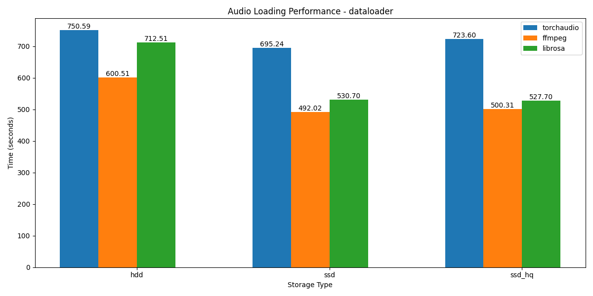

# Audio Loading Speed Test

This project compares the performance of iterable dataloaders when loading a large-scale audio dataset (100k samples, 860 hours) across different storage types and audio loading libraries.

- Comprehensive audio loading benchmarks:
  - Compare performance across storage types (HDD, SSD, NFS)
  - Test multiple popular audio libraries (torchaudio, ffmpeg, soundfile, librosa)
  - Measure both single file and batch loading speeds
  - Evaluate audio writing and resampling operations

## Requirements

- torchaudio 2.6.0
- ffmpeg 5.1.2
- soundfile 0.13.1
- librosa 0.11.0
- matplotlib

## Scripts

```
pip install -r requirements.txt
python3 cp_audio.py
python3 run_tests.py
```

### Visualizations

The benchmark results are visualized in two main plots:

1. Single File Performance (`audio_loading_performance_single_file.png`)
   - Compares loading times across different libraries
   - Includes error bars for timing variance

2. DataLoader Performance (`audio_loading_performance_dataloader.png`) 
   - Visualizes batch loading performance

Example visualizations:





## Support

For issues and feature requests, please use the GitHub issue tracker.